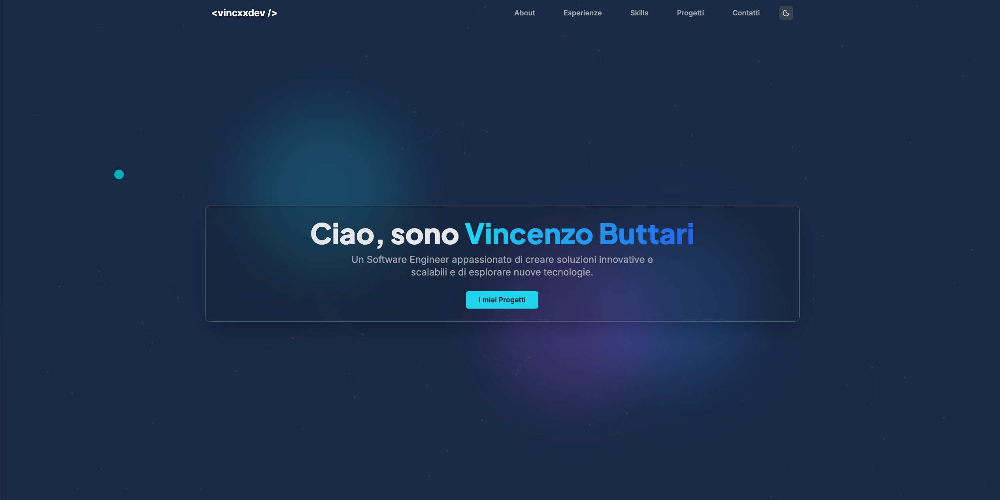

# Portfolio Personale di vincxxdev

Questo è il repository per il mio portfolio personale, costruito con Next.js, TypeScript e Tailwind CSS.

**[Guarda la Live Demo](https://vincxx.dev)**

---

## Anteprima



---

## ✨ Features

- **Design Moderno e Responsivo**: Interfaccia pulita e completamente accessibile da qualsiasi dispositivo.
- **Tema Scuro/Chiaro**: Switch tra modalità chiara e scura con persistenza delle preferenze.
- **Animazioni fluide**: Transizioni e animazioni realizzate con Framer Motion per un'esperienza utente dinamica.
- **Sfondo Interattivo**: Particelle animate in background create con tsParticles.
- **Architettura Scalabile**: Contenuti come esperienze, skill e progetti sono gestiti tramite file di dati, rendendo l'aggiornamento del portfolio semplice e veloce senza toccare il codice.

---

## 🛠️ Tech Stack & Librerie

<p align="center">
  
  
  
  
  
  
</p>

---

## 🚀 Come Iniziare

Per eseguire il progetto in locale, segui questi passaggi:

1.  **Clona il repository:**
    ```bash
    git clone https://github.com/vincxxdev/portfolio.git
    cd portfolio
    ```

2.  **Installa le dipendenze:**
    ```bash
    npm install
    ```

3.  **Avvia il server di sviluppo (con Turbopack):**
    ```bash
    npm run dev
    ```

4.  **Apri il browser:**
    Naviga su [http://localhost:3000](http://localhost:3000) per vedere il risultato.

### Altri Comandi Utili

-   **Build per produzione:**
    ```bash
    npm run build
    ```
-   **Avvio in produzione:**
    ```bash
    npm run start
    ```
-   **Controllo Linting:**
    ```bash
    npm run lint
    ```

---

## 📈 Aggiornare i Contenuti

Grazie all'architettura data-driven, puoi aggiornare facilmente le sezioni del portfolio modificando i file nella directory `src/data`:

-   **Esperienze**: Modifica `src/data/experiences.ts`
-   **Certificazioni**: Modifica `src/data/certifications.ts`
-   **Competenze (Skills)**: Modifica `src/data/skills.ts`
-   **Progetti**: Modifica `src/data/projects.ts`

Il sito si aggiornerà automaticamente con i nuovi dati dopo aver riavviato il server di sviluppo.

---

## 🔧 Configurazione Variabili d'Ambiente

Il progetto utilizza variabili d'ambiente per gestire configurazioni dinamiche come URL, contatti e link social.

### Setup

1. **Copia il file di esempio:**
   ```bash
   cp .env.example .env.local
   ```

2. **Modifica i valori** in `.env.local` con le tue informazioni

3. **Riavvia il server** di sviluppo:
   ```bash
   npm run dev
   ```

### Variabili Disponibili

#### Configurazione Sito
- `NEXT_PUBLIC_SITE_URL` - URL principale del sito (usato per sitemap e metadata)

#### Contatti
- `NEXT_PUBLIC_CONTACT_EMAIL` - Email di contatto
- `NEXT_PUBLIC_CONTACT_PHONE` - Numero di telefono (formato: +39...)
- `NEXT_PUBLIC_CONTACT_PHONE_DISPLAY` - Numero di telefono formattato per visualizzazione

#### Social Media
- `NEXT_PUBLIC_GITHUB_URL` - Link profilo GitHub
- `NEXT_PUBLIC_LINKEDIN_URL` - Link profilo LinkedIn

#### Analytics (Opzionale)
- `NEXT_PUBLIC_GA_MEASUREMENT_ID` - Google Analytics ID
- `NEXT_PUBLIC_PLAUSIBLE_DOMAIN` - Dominio Plausible Analytics

### Dove Vengono Usate

Le variabili d'ambiente sono centralizzate in `/src/config/site.ts` e vengono utilizzate in:

- **Footer** - Link social media
- **Contacts** - Email e telefono
- **Sitemap** - URL base per SEO
- **Metadata** - URL e informazioni per Open Graph e Twitter Cards

### Note Importanti

- Le variabili con prefisso `NEXT_PUBLIC_` sono esposte al browser
- Non committare mai il file `.env.local` (è già in `.gitignore`)
- Dopo aver modificato le env variables, riavvia il server di sviluppo
- Tutte le variabili hanno valori di default, quindi il sito funziona anche senza `.env.local`

### Deploy su Vercel

Quando fai il deploy su Vercel, aggiungi le variabili d'ambiente nel pannello di controllo:

1. Vai su **Project Settings** → **Environment Variables**
2. Aggiungi tutte le variabili da `.env.example`
3. Salva e ri-deploya

---
